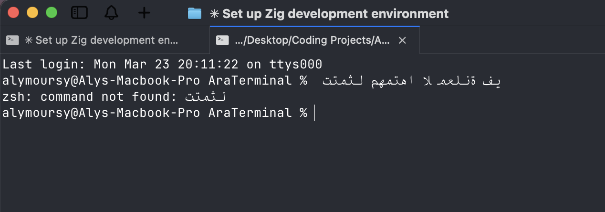
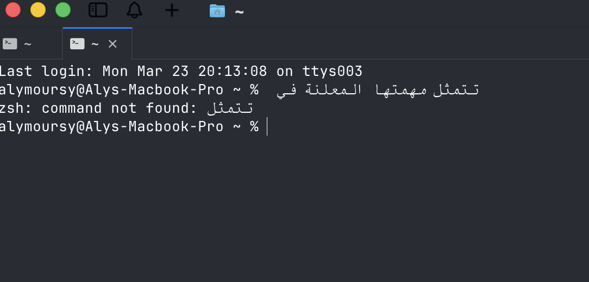

<h1 align="center">amux</h1>
<h3 align="center">A GPU-accelerated terminal with Arabic rendering</h3>

<p align="center">
  <a href="https://github.com/alymoursy/amux/releases/latest/download/AMUX-macos.dmg">
    
  </a>
</p>

<p align="center">
  <a href="README.ar.md">العربية</a> | English
</p>

### Before vs After

| Before (cmux) | After (amux) |
|---|---|
|  |  |
| Disconnected, isolated letter forms. Reversed character order. | Connected letters with proper joining. Correct bidirectional rendering. |

## What is amux?

amux (Arabic MUX) is a fork of [cmux](https://github.com/manaflow-ai/cmux) that adds proper Arabic and RTL text rendering to the terminal. Arabic text currently renders as disconnected, reversed glyphs in every GPU-accelerated terminal — Ghostty, cmux, Kitty, Alacritty. amux fixes this.

Built by the [Artificial Intelligence Company of Cairo](https://artificialintelligencecc.com). Building AI for Arab realities. If AI coding agents run in terminals, and terminals can't render Arabic, then 400+ million Arabic speakers are excluded from the AI coding revolution.

## Features

Everything from cmux, plus:

- **Arabic text shaping** — letters connect with correct contextual forms (initial, medial, final, isolated)
- **Bidirectional rendering** — Arabic/Hebrew text displays in the correct right-to-left visual order using the Unicode Bidirectional Algorithm (UAX #9)
- **Tashkeel support** — diacritical marks (fatha, kasra, damma, shadda, etc.) position correctly
- **Mixed text** — Arabic and English on the same line render correctly
- **Hebrew support** — RTL rendering works for Hebrew text too
- **All cmux features** — vertical tabs, split panes, AI agent notifications, embedded browser, Ghostty config compatibility

## Installation

### Download

Download the latest `.dmg` from [Releases](https://github.com/alymoursy/amux/releases).

### Build from source

Requirements: macOS, Zig 0.15.2+, Xcode

```bash
git clone https://github.com/alymoursy/amux.git
cd amux
git submodule update --init --recursive
./scripts/setup.sh
./scripts/reload.sh --tag arabic
```

## How it works

The core RTL rendering is powered by [itijah](https://github.com/DiaaEddin/itijah), a pure-Zig implementation of the Unicode Bidirectional Algorithm (UAX #9). The integration was developed in [ghostty PR #11079](https://github.com/ghostty-org/ghostty/pull/11079) by [@DiaaEddin](https://github.com/DiaaEddin), which we merged into our Ghostty submodule.

The approach:
1. **Bidi analysis** — itijah resolves embedding levels for each character per UAX #9
2. **Visual run splitting** — the run iterator splits text at direction boundaries, emitting LTR and RTL runs separately
3. **Direction-aware shaping** — CoreText receives the correct embedding level (0 for LTR, 1 for RTL) per run, enabling native Arabic joining and ligature support
4. **Cell mapping** — shaped glyphs are mapped back to terminal grid cells with correct positioning

## Test it

```bash
echo "Arabic: مرحبا بالعالم"
echo "Mixed: Hello مرحبا World"
echo "Tashkeel: بِسْمِ اللَّهِ الرَّحْمَنِ الرَّحِيمِ"
```

## Known limitations

- **Cursor positioning** — cursor movement is wrong when typing RTL in an interactive shell (the terminal model is still LTR). Pre-composed output (`echo`, `cat`) renders correctly.
- **Selection** — text selection follows logical order, not visual order.
- **RTL line wrapping** — long Arabic lines wrap at the terminal width using standard LTR wrapping.
- These limitations match the upstream ghostty PR scope and will improve as the upstream work progresses.

## Acknowledgments & Credits

amux stands on the shoulders of excellent open source work:

### Core dependencies

- **[cmux](https://github.com/manaflow-ai/cmux)** by Manaflow AI — the terminal we forked. amux inherits all of cmux's features: vertical tabs, split panes, AI agent notifications, embedded browser. Licensed under AGPL-3.0-or-later.

- **[Ghostty](https://github.com/ghostty-org/ghostty)** by Mitchell Hashimoto — the GPU-accelerated terminal engine (libghostty) that cmux and amux are built on. Licensed under MIT.

- **[itijah](https://github.com/DiaaEddin/itijah)** by [@DiaaEddin](https://github.com/DiaaEddin) — pure-Zig Unicode Bidirectional Algorithm (UAX #9) implementation that powers amux's RTL rendering. Licensed under MIT.

### The RTL implementation

The Arabic/RTL rendering in amux is based on **[ghostty PR #11079](https://github.com/ghostty-org/ghostty/pull/11079)** by [@DiaaEddin](https://github.com/DiaaEddin), which adds proper bidirectional text shaping to Ghostty's font shaper. This PR modifies the CoreText and HarfBuzz shapers, the run iterator, and adds bidi-aware visual run splitting. We merged this PR into our Ghostty submodule.

### Inspiration

- **[commandlinetips/ghostty](https://github.com/commandlinetips/ghostty)** — an earlier proof-of-concept RTL fork of Ghostty using FriBidi, which demonstrated that Arabic rendering in Ghostty-based terminals was achievable.

- **[cmux issue #547](https://github.com/manaflow-ai/cmux/issues/547)** — the RTL feature request on cmux that tracks this work.

- **[ghostty issue #1442](https://github.com/ghostty-org/ghostty/issues/1442)** — the upstream Ghostty RTL issue.

## Changes from upstream cmux

See [CHANGELOG.md](CHANGELOG.md) for a detailed list. Key modifications:

1. **Ghostty submodule** — merged [ghostty PR #11079](https://github.com/ghostty-org/ghostty/pull/11079) for RTL shaping support (itijah bidi, CoreText RTL embedding, HarfBuzz RTL direction, bidi-aware run iterator)
2. **Branding** — renamed from cmux to amux (product name, bundle ID, user-facing strings, app icon)
3. **App icon** — custom amux logo

## License

amux is licensed under the **GNU Affero General Public License v3.0 or later** (AGPL-3.0-or-later), inherited from cmux.

See [LICENSE](LICENSE) for the full text.

Third-party licenses are listed in [THIRD_PARTY_LICENSES.md](THIRD_PARTY_LICENSES.md).

## Contributing

Contributions are welcome. If you're working on Arabic terminal rendering, RTL improvements, or have feedback from using amux with Arabic text, please open an issue or PR.

---

<p align="center">
  Built by the <a href="https://artificialintelligencecc.com">Artificial Intelligence Company of Cairo</a> — building AI for Arab realities.
</p>
